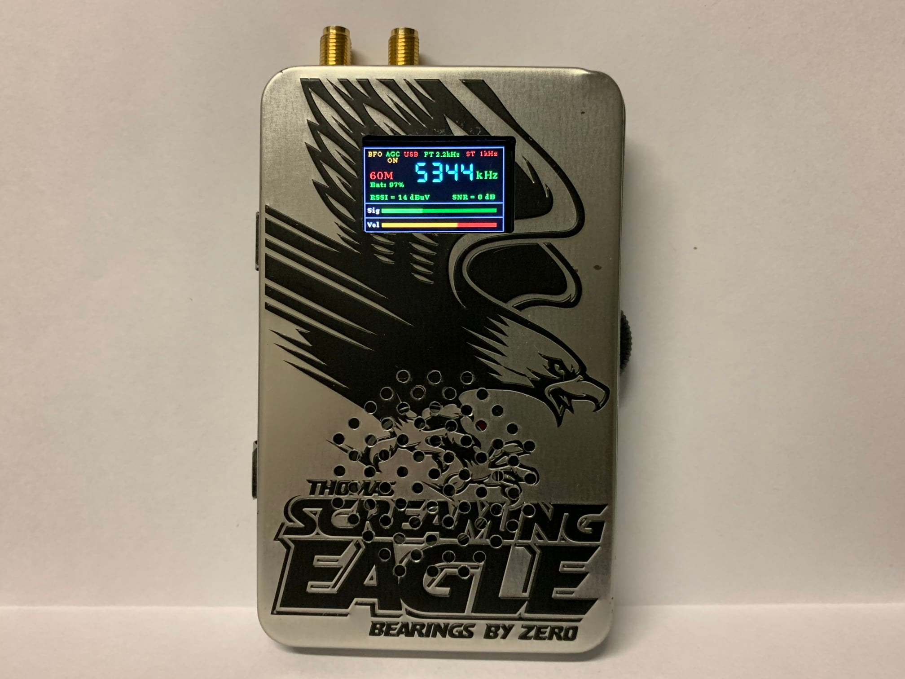
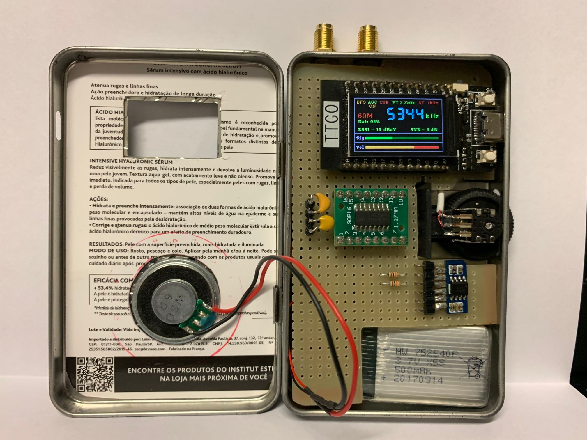
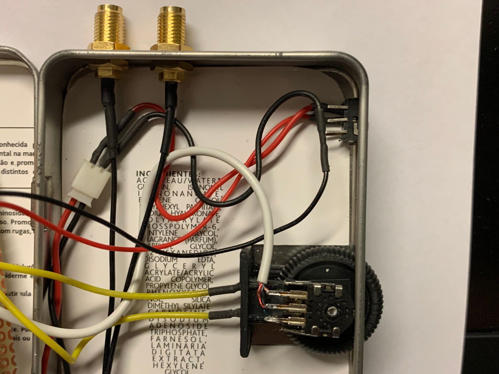

# Si473x Radio using TTGO T-Display

This Si473x Radio uses the amazing library written by [PU2CLR (Ricardo Caratti)](https://github.com/pu2clr/SI4735). It is based on sketches by [PE0MGB (Gert Baak)](https://github.com/pe0mgb/SI4735-Radio-ESP32-Touchscreen-Arduino) and [Thiago Lima](https://github.com/pu2clr/SI4735/tree/master/examples/SI47XX_KITS/THIAGO_LIMA). Since my main goal is a simple portable radio, I am using a [TTGO T-Display](http://www.lilygo.cn/prod_view.aspx?Id=1126), which is a small ESP-32 board with a 1.14 inch display. To fit all the informations in the small size of the screen, it was necessary to adapt the navigation menu. I'm sharing the code and results in this repository.

Reasons to choose this boards are:

* Small footprint
* Good processor
* Enough RAM
* Good screen resolution
* Built-in battery charger circuit
* WiFi/BLE (for future improvements)
* And it's cheap

# Releases

## [V4.1 - New TTGO T-Display version based on Gert Baak's V3.4](Si473x_Rotary_Encoder_Interface_V4.1)

* New user interface 
* "Press and hold" performing different actions
* Battery icon
* Bug fixes

For more details, see [README V4.1](Si473x_Rotary_Encoder_Interface_V4.1/README.md).

## [V3 - Initial Release](Si473x_Rotary_Encoder_Interface)

First release. Alpha version

# Proof of concept

As a proof of concept, I built a pocket radio using a can of skateboard bearings. This can is smaller than an Altoids tin.

# Component Parts

* Si4732
* [TTGO T-Display](http://www.lilygo.cn/prod_view.aspx?Id=1126)
* [NS8002 Module (audio amplifier)](https://www.aliexpress.com/item/32965170167.html)
* Rotary encoder and switch (Built from a mouse wheel)
* Speaker
* LiPo Battery
* [SMA connectors for antenna](https://www.aliexpress.com/item/4000848776660.html)
* Resistors/Capacitors/Wires
* Case

# Schematics:

* Si4735

* Si4732

# Videos:

* [Si473x - New menu - First test](https://youtu.be/CNm_gOjVeSI)
* [Si473x - New Menu and Display Animation](https://youtu.be/rIns9fEK_OY)
* [Portable Si473x Radio - Encoder and Button Test](https://youtu.be/reAo4QKGGc8)
* [Portable SI473x Radio - Fully Assembled! (Bonus: Inside view)](https://youtu.be/i_zdgfHkd_8)

# Pictures:

## Version V3

* Front view

* Side view

* Inside view

* Rotary encoder and antenna

* Rotary encoder

* Rotary encoder close view

## Version V4.1

* Main View

* Menu View

# References

1. [PU2CLR SI4735 Library for Arduino](https://github.com/pu2clr/SI4735)

2. [SI4735-Radio-ESP32-2.8 inch TFT Touchscreen-Arduino](https://github.com/pe0mgb/SI4735-Radio-ESP32-Touchscreen-Arduino)

3. [https://github.com/pu2clr/SI4735/tree/master/examples/SI47XX_KITS/THIAGO_LIMA](https://github.com/pu2clr/SI4735/tree/master/examples/SI47XX_KITS/THIAGO_LIMA)

4. [TTGO T-Display](https://github.com/Xinyuan-LilyGO/TTGO-T-Display)

# DISCLAMER

ATTENTION: The author of this project does not guarantee that procedures shown here will work in your development environment.
Given this, it is at your own risk to continue with the procedures suggested here.

This library works with the I2C communication protocol and it is designed to apply a SSB extension PATCH to CI SI4735-D60.
Once again, the author disclaims any liability for any damage this procedure may cause to your SI4735 or other devices, like an ATS-100 that you are using.

There is NO GUARANTEE that this sketch will work with the Chinese ATS-100 KIT sold on AliExpress, eBay etc.

The author of this sketch and Arduino Library does not know the seller of this kit and does not have a commercial relationship with any commercial product that uses the Arduino Library.

It is important you understand that there is no guarantee that this sketch will work correctly in your current product.

SO, DO NOT TRY IT IF YOU DON'T KNOW WHAT ARE YOU DOING. YOU MUST BE ABLE TO GO BACK TO THE PREVIOUS VERSION IF THIS SKETCH DOES NOT WORK FOR YOU.
